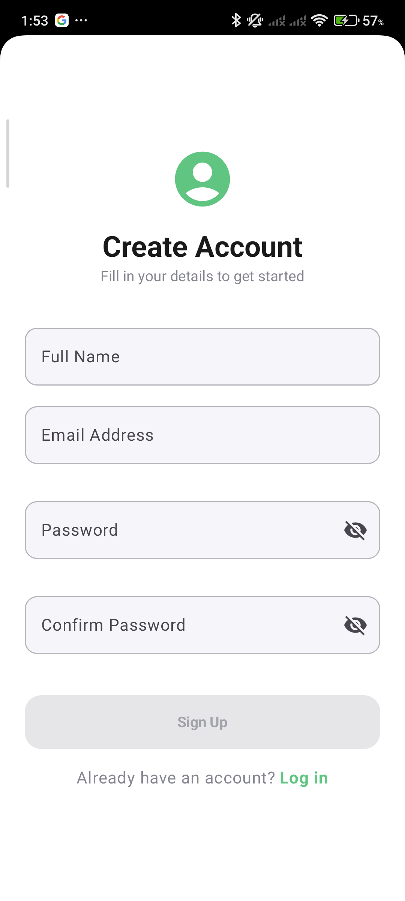
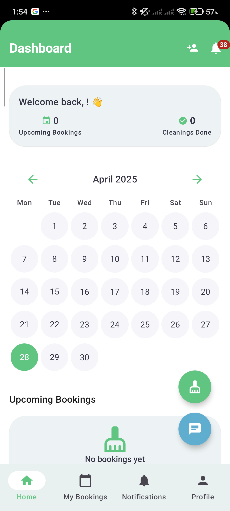
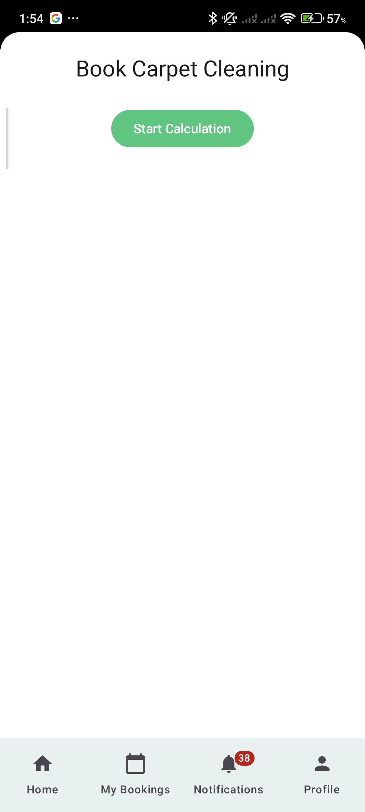
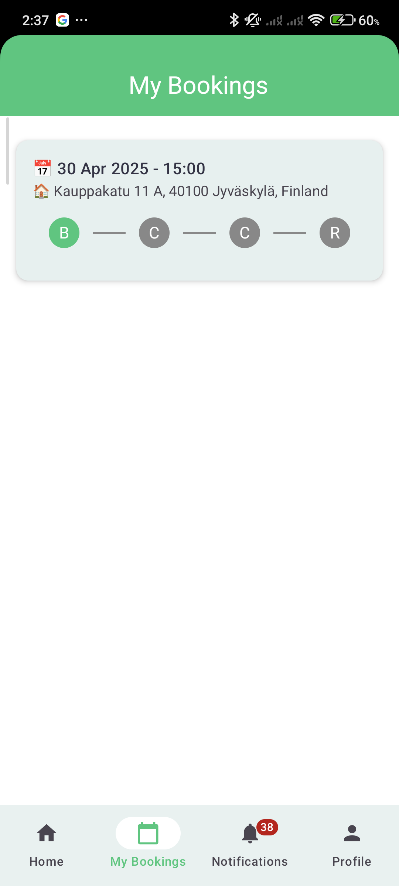
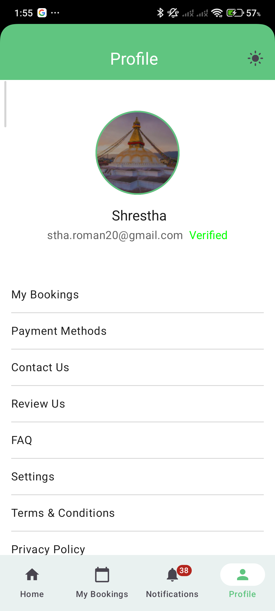
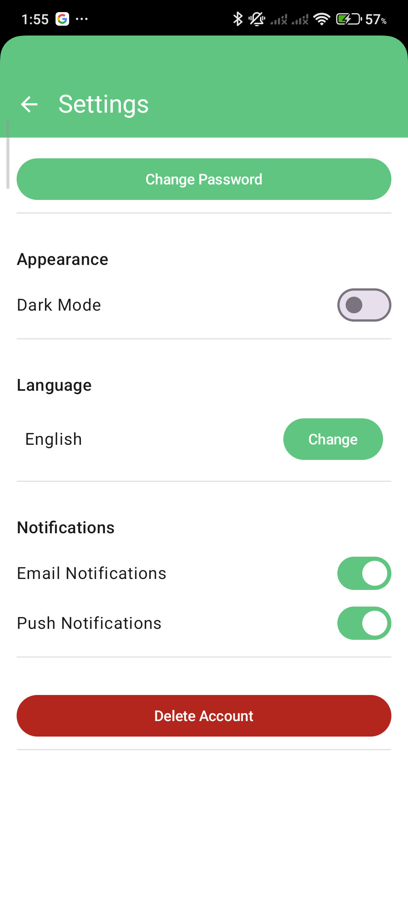
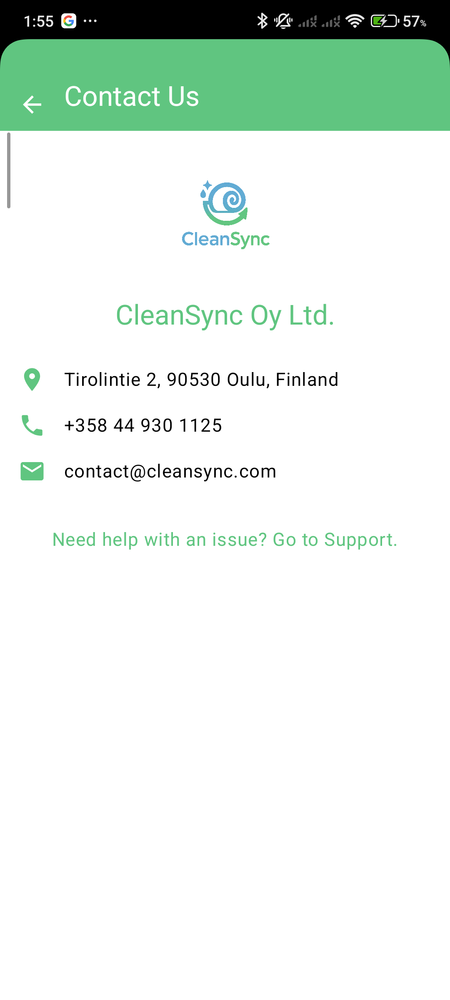

# 🧹 CleanSync


---

## 📑 Table of Contents

- 📱 [Installation & Quick Start](#-installation--quick-start)
- 🔐 [Firebase Setup](#-firebase-setup)
- 👨🏻‍🏫 [Introduction](#-introduction)
- 🧪 [Features](#-features)
- 🖼️ [App UI Preview](#-app-ui-preview)
- 📚 [Pages Overview](#-pages-overview)
  - 👤 [Profile Management](#-profile-management)
  - 🔒 [Authentication Flow](#-authentication-flow)
  - 🏠 [Home and Booking Pages](#-home-and-booking-pages)
  - 🔔 [Notifications Page](#-notifications-page)
  - ⚙️ [Settings and Theme Control](#-settings-and-theme-control)
- 🧩 [Technologies Used](#-technologies-used)
- 📂 [Folder Structure](#-folder-structure)
- 🛠️ [Contribution](#-contribution)
- 📜 [License](#-license)
- 👥 [Authors](#-authors)

---

## 📱 Installation & Quick Start

Clone the repository:

```bash
git clone https://github.com/Mobile-Development-Project-Group-22/CleanSync.git
cd CleanSync
```

Open in **Android Studio**, let **Gradle** sync, and run the app on a connected device or emulator.

---

## 🔐 Firebase Setup

To connect CleanSync with Firebase services:

1. Go to [Firebase Console](https://console.firebase.google.com/).
2. Create a new project.
3. Enable **Authentication** (Email/Password and Google Sign-In).
4. Enable **Firebase Storage**.
5. Download the `google-services.json` and add it inside the `app/` directory.
6. Sync Gradle and build the project.

---

## 👨🏻‍🏫 Introduction

**CleanSync** is a clean, modern Android application built with **Kotlin** and **Jetpack Compose**, focused on providing smooth user management, booking functionality, notification handling, and theme customization. It integrates Firebase Authentication and Storage while following Material Design 3 principles.

---

## 🧪 Features

- 🔐 Secure Authentication (Email/Password + Google Sign-In)
- 👤 Profile Management (Update Picture, Personal Info)
- 🌓 Light & Dark Theme Switching
- 📑 Static Pages (FAQs, Terms of Service, Privacy Policy)
- 🔒 Change Password, Account Deletion
- 🔔 Notifications with Worker API
- 🛜 Firebase Integration for Authentication & Storage
- 🎨 Material Design 3 UI Components

---

🖼️ App UI Preview
(Screenshots preview below — optimized for layout)

Login / Register

 

Home Page


Booking Interface




Notifications


Profile Page


Settings


About Us



---

## 📚 Pages Overview

### 👤 Profile Management

- View and edit user profile information.
- Upload/reset profile pictures.
- Logout or delete account securely.

### 🔒 Authentication Flow

- Login and Registration pages built with Jetpack Compose.
- Google Sign-In supported.
- Forgot Password flow via Firebase Authentication.

### 🏠 Home and Booking Pages

- Home page showcasing available actions or services.
- Booking screens for service management.

### 🔔 Notifications Page

- In-app notification center.
- Background push handling via **WorkManager**.

### ⚙️ Settings and Theme Control

- Light/Dark mode toggling.
- Access static legal pages like FAQs, Terms, and Privacy Policies.

---

## 🧩 Technologies Used

| Technology                      | Purpose                                      |
|----------------------------------|----------------------------------------------|
| Kotlin                           | Primary programming language                 |
| Jetpack Compose                  | UI Framework                                 |
| Firebase Authentication & Storage | Authentication and file storage             |
| Coil                             | Image loading library                        |
| Accompanist Permissions          | Handling runtime permissions                 |
| WorkManager                      | Background notification handling             |
| Material 3 Design Components     | Modern Android UI and UX guidelines          |
| Gradle                           | Project and dependency management            |

---

## 📂 Folder Structure

```
CleanSync/
├── CleanSyncApp.kt         # Application class
├── MainActivity.kt         # Main activity entry point
├── data/                   # Data Layer (models, repositories, services)
│   ├── model/
│   ├── repository/
│   └── service/
├── navigation/             # App Navigation Setup
│   ├── AppNavHost.kt
│   ├── BottomNavBar.kt
│   ├── NavigationItem.kt
│   └── Screen.kt
├── ui/                     # UI Layer
│   ├── auth/               # Authentication Pages
│   ├── booking/            # Booking Pages
│   ├── components/         # Reusable UI Components
│   ├── home/               # Home Page
│   ├── notifications/      # Notifications Handling
│   ├── profile/            # Profile Page
│   └── theme/              # App Theme (Light/Dark)
├── utils/                  # Utilities and Helpers
│   ├── DateTimeUtils.kt
│   ├── NotificationUtils.kt
│   └── NotificationWorker.kt
├── google-services.json     # Firebase Configuration
├── build.gradle             # Build Script
└── README.md                # Documentation
```

---

## 🛠️ Contribution

We welcome all contributions! 🚀

1. Fork the project
2. Create a feature branch: `git checkout -b feature/AmazingFeature`
3. Commit your changes: `git commit -m 'Add some AmazingFeature'`
4. Push to the branch: `git push origin feature/AmazingFeature`
5. Open a pull request

---

## 📜 License

Distributed under the **MIT License**. See `LICENSE` file for details.

---

## 👥 Authors

**Mobile Development Project - Group 22**

- Romansh Shrestha - t3shro00@students.oamk.fi
- Seraj Shekh - t3shse@students.oamk.fi
- Rohit Pariyar - t3paro00@students.oamk.fi

---

✅ **CleanSync** — Clean, Simple, and Smart Mobile Profile Management.


