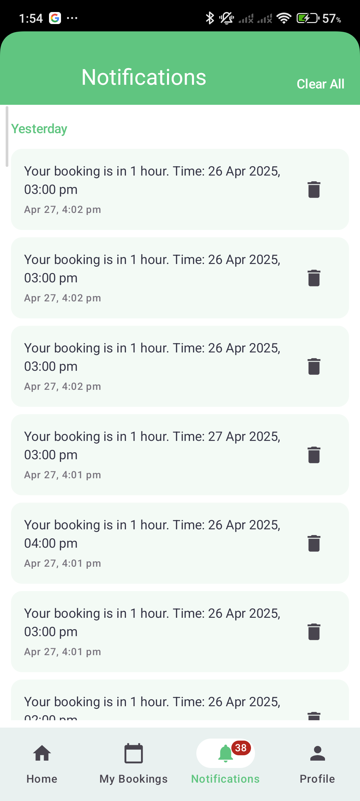

🧹 CleanSync
CleanSync is a cutting-edge Android application developed using Kotlin and Jetpack Compose, specifically designed to streamline user management, booking functionality, and notifications. It integrates Firebase Authentication and Firebase Storage while adhering to the latest Material Design 3 guidelines for a seamless and modern mobile experience.

📑 Table of Contents
📱 Installation & Quick Start

🔐 Firebase Setup

👨🏻‍🏫 Introduction

🧪 Key Features

🖼️ App UI Preview

📚 Page Features

👤 Profile Management

🔒 Authentication Flow

🏠 Home and Booking Pages

🔔 Notifications Page

⚙️ Settings & Theme Control

🧩 Technologies Used

📂 Folder Structure

🛠️ How to Contribute

📜 License

👥 Authors

📱 Installation & Quick Start
To get started with CleanSync, follow these simple steps:

Clone the repository:

bash
Copy code
git clone https://github.com/Mobile-Development-Project-Group-22/CleanSync.git
cd CleanSync
Open the project in Android Studio.

Allow Gradle to sync the project.

Run the application on a connected Android device or an emulator.

🔐 Firebase Setup
To enable Firebase features, perform the following steps:

Go to the Firebase Console.

Create a new project or select an existing one.

Enable Firebase Authentication (both Email/Password and Google Sign-In).

Enable Firebase Storage to handle user data and files.

Download the google-services.json file from Firebase and add it to your app/ directory.

Sync Gradle and rebuild the project to connect with Firebase.

👨🏻‍🏫 Introduction
CleanSync is designed with simplicity and usability in mind. By leveraging Kotlin and Jetpack Compose, the app offers smooth transitions, interactive UIs, and rich features that enhance the mobile user experience. The app integrates tightly with Firebase Authentication and Storage to securely manage user profiles, bookings, and notifications. The user interface follows the best practices of Material Design 3, ensuring an aesthetically pleasing and intuitive experience.

🧪 Key Features
CleanSync boasts a variety of features to cater to a modern mobile application experience:

🔐 Secure Authentication: Users can sign in via Email/Password or Google Sign-In.

👤 Profile Management: Update personal information, change profile pictures, and manage account settings.

🌓 Light/Dark Mode: Switch between Light and Dark themes for a personalized experience.

📑 Static Pages: Access important information, including FAQs, Terms of Service, and Privacy Policy.

🔒 Account Security: Change passwords and securely delete accounts.

🔔 Push Notifications: Receive notifications with background processing using the WorkManager API.

🛜 Firebase Integration: Firebase Authentication for login and Firebase Storage for user data management.

🎨 Material Design 3: The app's interface follows the latest design principles for a clean, modern look.

🖼️ App UI Preview
Here’s a glimpse of the app’s polished user interface:

Login / Register Screens
 

Home Page

Booking Interface

Notifications Page

Profile Page

Settings Page

About Us

📚 Page Features
👤 Profile Management
Edit Profile: Update personal details such as name, email, and contact information.

Profile Picture: Upload a new photo or reset the current one.

Account Deletion: Securely delete your account, with confirmation prompts.

🔒 Authentication Flow
Login & Registration: A seamless flow with Email/Password and Google Sign-In options.

Password Reset: Forgot your password? Easily reset it via email with Firebase Authentication.

🏠 Home and Booking Pages
Home Page: A dashboard displaying quick actions and available services.

Booking Management: Easily book services, view upcoming reservations, and manage appointments.

🔔 Notifications Page
In-App Notifications: Get notified about important events and updates.

Push Notifications: Background notifications are handled using WorkManager, ensuring timely delivery even when the app is not active.

⚙️ Settings & Theme Control
Light/Dark Theme: Toggle between themes for optimal viewing in different environments.

Legal Pages: Access static pages like FAQs, Terms of Service, and Privacy Policy directly from the settings.

🧩 Technologies Used
Technology	Purpose
Kotlin	Primary programming language for Android development
Jetpack Compose	UI framework for declarative UI components
Firebase Authentication & Storage	User authentication and file storage
Coil	Efficient image loading library
Accompanist Permissions	Simplifies permission requests at runtime
WorkManager	Manages background tasks like notifications
Material Design 3 Components	Ensures consistent, modern UI/UX design
Gradle	Build and dependency management
📂 Folder Structure
The project follows a modular and clean architecture:

bash
Copy code
CleanSync/
├── CleanSyncApp.kt         # Application class, setup initialization
├── MainActivity.kt         # Main entry activity
├── data/                   # Data Layer (models, repositories, services)
│   ├── model/              # Data models
│   ├── repository/         # Data repositories
│   └── service/            # Services (API, Firebase interaction)
├── navigation/             # Navigation Setup (AppNavHost, BottomNav)
├── ui/                     # UI Layer (Screens and Components)
│   ├── auth/               # Authentication Screens
│   ├── booking/            # Booking Screens
│   ├── components/         # Reusable UI Components
│   ├── home/               # Home Screen
│   ├── notifications/      # Notification Management
│   ├── profile/            # Profile Management Screen
│   └── theme/              # Theme Management (Light/Dark)
├── utils/                  # Helper Classes & Utilities
│   ├── DateTimeUtils.kt
│   ├── NotificationUtils.kt
│   └── NotificationWorker.kt
├── google-services.json     # Firebase config file
├── build.gradle             # Build script for dependencies
└── README.md                # Documentation and project details
🛠️ How to Contribute
We welcome contributions from developers and enthusiasts! Follow these steps to contribute:

Fork the project to your own GitHub repository.

Create a new branch for your feature: git checkout -b feature/yourFeature.

Commit your changes: git commit -m 'Add new feature'.

Push the changes to your forked repository: git push origin feature/yourFeature.

Open a pull request to merge your changes with the main project.

📜 License
CleanSync is distributed under the MIT License. For more details, please refer to the LICENSE file.

👥 Authors
This project was created by the Mobile Development Project - Group 22:

Romansh Shrestha - t3shro00@students.oamk.fi

Seraj Shekh - t3shse@students.oamk.fi

Rohit Pariyar - t3paro00@students.oamk.fi

✅ CleanSync — Simplifying Mobile Profile Management with a Clean, Modern UI.